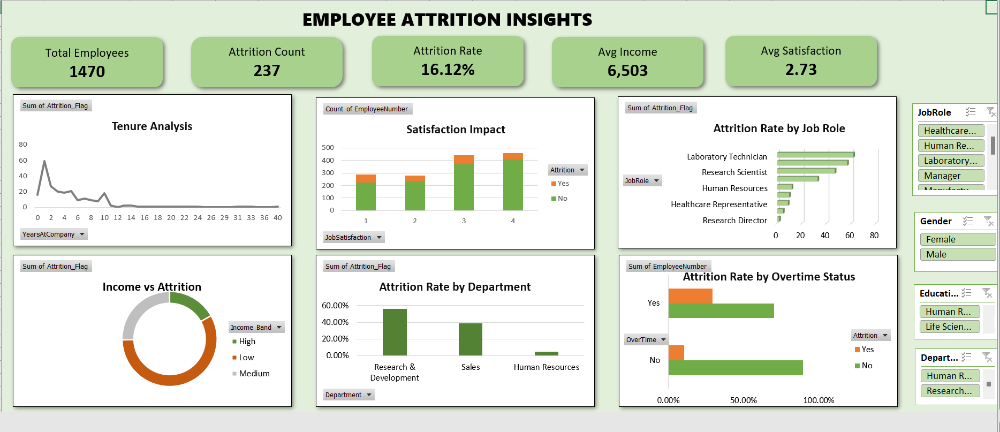

# Employee Attrition Analysis – Excel Dashboard

## 📌 Project Description
This project is an interactive Excel-based dashboard designed to analyze employee attrition and identify key factors contributing to employee turnover. The analysis helps HR teams and business stakeholders make data-driven decisions to improve employee retention.

The entire workflow—including dataset, data cleaning, analysis, pivot tables, and dashboard—is maintained within a single Excel workbook for clarity and ease of use.

---

## 📊 Dashboard Overview
The dashboard provides a high-level and detailed view of employee attrition across multiple dimensions such as tenure, income, department, job role, satisfaction level, gender, education field, and overtime status.

### Key KPIs:
- **Total Employees**
- **Attrition Count**
- **Attrition Rate (%)**
- **Average Monthly Income**
- **Average Job Satisfaction**

---

## 🔍 Key Insights
- Employees working **overtime** show significantly higher attrition rates.
- **Lower income bands** experience higher employee turnover.
- Employees with **lower job satisfaction** are more likely to leave the company.
- The **Research & Development** department records the highest attrition.
- **Early-tenure employees (0–5 years)** have a higher likelihood of attrition.

---

## 🛠 Tools & Techniques Used
- Microsoft Excel
- Data cleaning and preprocessing
- Pivot Tables & Pivot Charts
- KPI cards with calculated fields
- Interactive slicers (Job Role, Gender, Department, Education Field)
- Percentage-based analysis for attrition impact
- Professional dashboard design and formatting

---

---

## 📸 Dashboard Preview

---

## 🎯 Business Value
This dashboard enables HR and management teams to:
- Identify high-risk attrition segments
- Understand key drivers of employee turnover
- Support retention strategies with data-driven insights
- Improve workforce planning and employee satisfaction

---

## 📌 Author
**Lubaba**  
Aspiring Data Analyst
